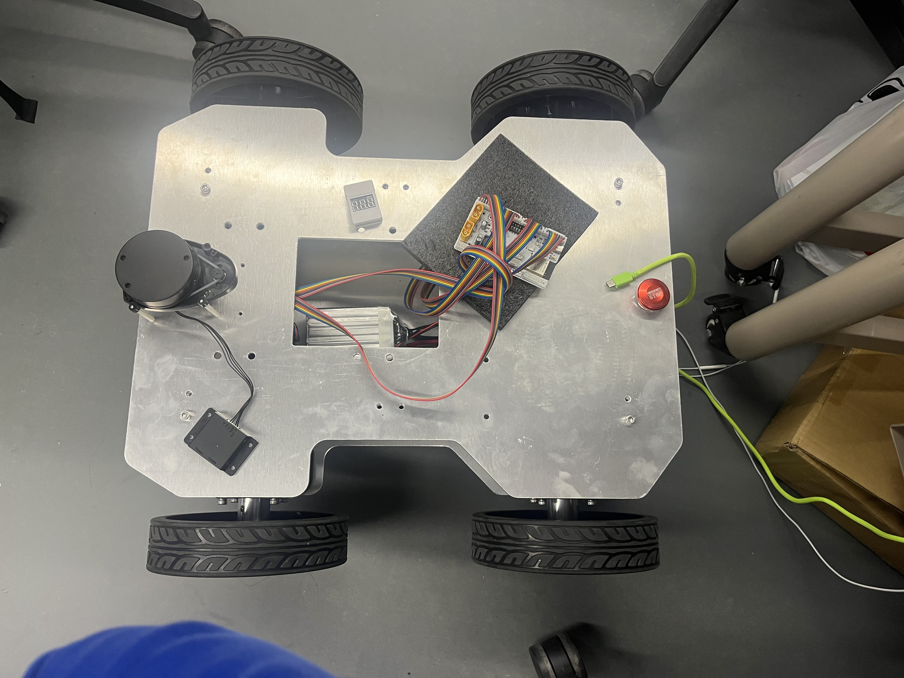

# ESP32 小车控制系统

这是一个基于ESP32的小车控制系统，支持通过MQTT和USB串口两种方式进行远程控制。系统实现了完整的运动控制功能，包括速度模式和位置模式，并提供了实时状态反馈。



## 功能特点

- **双通道控制**：支持MQTT无线控制和USB串口控制
- **多种运动模式**：
  - 速度模式：控制小车以指定速度运动
  - 位置模式：控制小车移动指定距离和角度
- **实时状态反馈**：提供小车速度和电机状态的实时反馈
- **动态配置**：支持运行时修改WiFi连接和状态发布间隔
- **灵活的日志系统**：多级别日志控制，便于调试和生产环境使用

## 硬件要求

- ESP32开发板
- 四轮小车底盘
- 四个步进电机及驱动器
- USB连接线（用于串口控制和调试）
- 电源系统

## 软件依赖

- PlatformIO开发环境
- Arduino框架
- PubSubClient库（MQTT客户端）
- ArduinoJson库

## 快速开始

### 编译与上传

1. 克隆本仓库
   ```bash
   git clone https://github.com/wds-dxh/Universal_chassis.git
   cd Universal_chassis/Universal_chassis
   ```

2. 使用PlatformIO编译并上传
   ```bash
   pio run -t upload
   ```

### 基本使用

1. **通过USB串口控制**

   连接ESP32到电脑，使用提供的Python测试脚本进行控制：
   ```bash
   python control_serial.py --port /dev/ttyUSB0
   ```

   在交互式命令行中，可以输入各种控制命令：
   ```
   > speed 0.5                # 以0.5 m/s的速度前进
   > move 1.0 0 0 0.5         # 前进1米，速度0.5 m/s
   > stop                     # 紧急停止
   ```

2. **通过MQTT控制**

   使用任何MQTT客户端连接到配置的MQTT服务器，然后发布控制命令到指定主题：
   ```
   主题: CarControl_001
   消息: {"command":"speed","vx":0.5,"vy":0,"omega":0}
   ```

   订阅状态主题以接收小车状态信息：
   ```
   主题: CarStatus_001
   ```

## 控制协议

系统使用JSON格式的控制协议，支持多种命令类型：

### 速度模式控制

```json
{
  "command": "speed",
  "vx": 0.5,
  "vy": 0.0,
  "omega": 0.1,
  "acceleration": 10.0
}
```

### 位置模式控制

```json
{
  "command": "move",
  "dx": 1.0,
  "dy": 0.0,
  "dtheta": 0.0,
  "speed": 0.5,
  "acceleration": 10.0,
  "subdivision": 256
}
```

### 紧急停止

```json
{
  "command": "stop"
}
```

### 获取状态

```json
{
  "command": "get_status"
}
```

## 高级配置

### 修改WiFi设置

可以通过控制命令动态修改WiFi连接：

```json
{
  "command": "set_wifi",
  "ssid": "MyWiFi",
  "password": "MyPassword"
}
```

### 调整状态发布频率

```json
{
  "command": "set_interval",
  "interval": 500
}
```

### 日志级别控制

在`main.cpp`中修改日志级别：

```cpp
#ifdef DEBUG_MODE
    Logger::init(LOG_LEVEL_DEBUG);
#else
    Logger::init(LOG_LEVEL_NONE);  // 生产环境禁用日志
#endif
```

## 相关模块

本仓库包含两个主要模块：

1. **硬件控制模块**（当前文档）：负责ESP32与步进电机的通信和控制
2. **Web控制界面**：提供基于Web的用户界面，可通过浏览器远程控制小车

要使用Web控制界面，请参考 [WebControl/readme.md](../WebControl/readme.md)。

## 贡献

欢迎提交问题报告和改进建议！请遵循以下步骤：

1. Fork本仓库
2. 创建您的特性分支 (`git checkout -b feature/amazing-feature`)
3. 提交您的更改 (`git commit -m 'Add some amazing feature'`)
4. 推送到分支 (`git push origin feature/amazing-feature`)
5. 打开Pull Request

## 许可证

本项目采用Apache License 2.0许可证 - 详情请参见[LICENSE](../LICENSE)文件

## 联系方式

项目维护者 - [wds-dxh](https://github.com/wds-dxh)

项目链接: [https://github.com/wds-dxh/Universal_chassis](https://github.com/wds-dxh/Universal_chassis) 