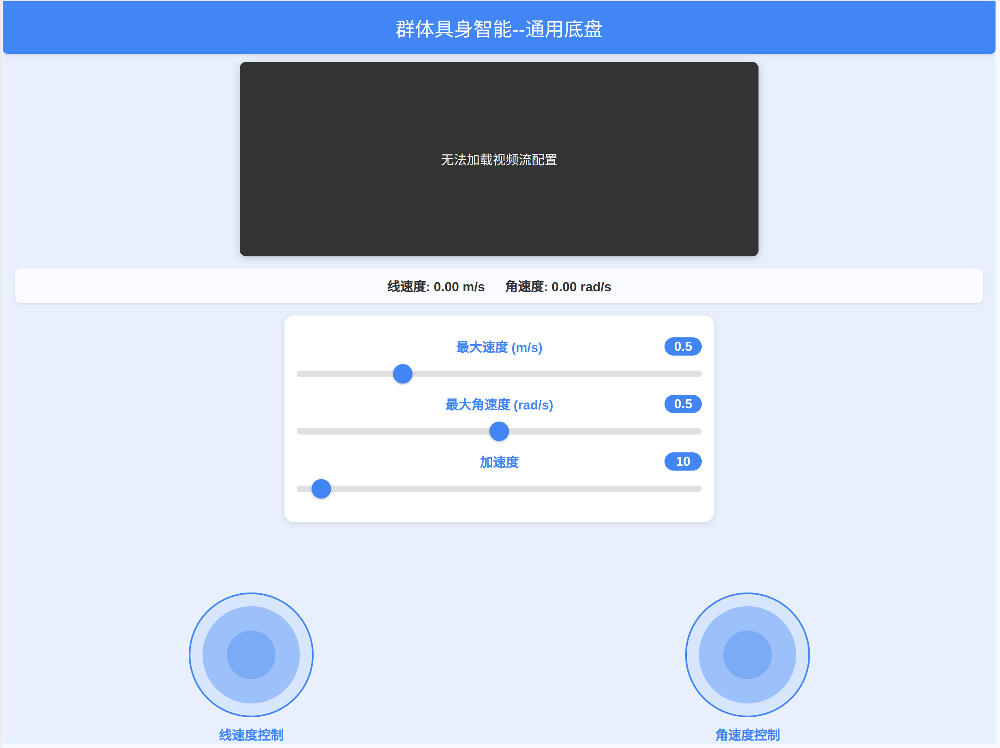

<!--
 * @Author: wds2dxh wdsnpshy@163.com
 * @Date: 2025-02-23 16:55:18
 * @Description: 
 * Copyright (c) 2025 by ${wds2dxh}, All Rights Reserved. 
-->
# 通用底盘控制系统

## 项目简介
通用底盘控制系统是一个基于 Web 的远程控制平台，支持多设备管理，提供实时视频流和双摇杆控制界面，适用于各类移动机器人底盘的远程操控。

### 主要特性
- 🎮 双摇杆控制界面
  - 左摇杆：控制线速度（前进/后退）
  - 右摇杆：控制角速度（左转/右转）
- 📹 实时视频流显示
- 🔐 多设备支持（基于设备ID）
- 📱 移动端友好的响应式设计
- ⚡ 低延迟的控制响应
- 🔄 MQTT 通信保证可靠性

## 系统界面



*系统控制界面展示了视频流区域、状态显示、参数设置滑块和双摇杆控制*

## 技术栈
- 前端：HTML5, CSS3, JavaScript, nipplejs
- 后端：Node.js, Express
- 通信：MQTT, WebSocket

## 快速开始

### 系统要求
- Node.js >= 14.0.0
- npm >= 6.0.0
- MQTT Broker (如 EMQX, Mosquitto)

### 安装步骤
1. 克隆仓库
```bash
git clone https://github.com/yourusername/universal-chassis-control.git
cd universal-chassis-control
```

2. 安装依赖
```bash
npm install
```

3. 配置系统
编辑 `config.js` 文件，设置：
- MQTT 服务器信息
- 视频流 URL
- 设备认证信息

4. 启动服务器
```bash
# 开发模式（支持热重载）
npm run dev

# 生产模式
npm start
```

### 配置说明

#### MQTT 主题格式
- 控制指令主题：`CarControl_<设备ID>`
- 状态信息主题：`CarStatus_<设备ID>`

示例：设备ID为 "001" 时
- 控制主题：`CarControl_001`
- 状态主题：`CarStatus_001`

#### 设备认证
- 设备ID：3位数字（例如：001, 002, ...）
- 默认密码：88888888

## 使用说明

1. 访问系统
   - 打开浏览器，访问 `http://localhost:3000`
   - 输入设备ID和密码登录

2. 控制界面
   - 左侧摇杆：上下移动控制前进/后退
   - 右侧摇杆：左右移动控制转向
   - 滑块控制：调整最大速度、最大角速度和加速度

3. 视频显示
   - 实时显示设备摄像头画面

## 控制协议

### 控制指令格式
```javascript
{
    command: "speed",
    vx: Number,     // 线速度 (-max_speed 到 +max_speed)
    vy: 0.0,        // 横向速度（当前版本未使用）
    omega: Number,  // 角速度 (-max_omega 到 +max_omega)
    acceleration: Number  // 加速度
}
```

### 停止命令
```javascript
{
    command: "stop"
}
```

## 部署指南

### 开发环境
使用 nodemon 实现热重载：
```bash
npm run dev
```

### 生产环境
推荐使用 PM2 进行进程管理：
```bash
# 安装 PM2
npm install -g pm2

# 启动应用
npm run pm2:start

# 查看日志
npm run pm2:logs
```

### 安全建议
1. 修改默认密码
2. 启用 HTTPS
3. 配置防火墙
4. 使用反向代理（如 Nginx）

## 项目结构
```
universal-chassis-control/
├── config.js         # 配置文件
├── server.js         # 服务器入口
├── control.html      # 控制页面
├── index.html        # 登录页面
├── package.json      # 项目配置
└── README.md         # 说明文档
```

## 许可证

本项目采用Apache License 2.0许可证 - 详情请参见[LICENSE](../LICENSE)文件

## 作者

wds2dxh (wdsnpshy@163.com)